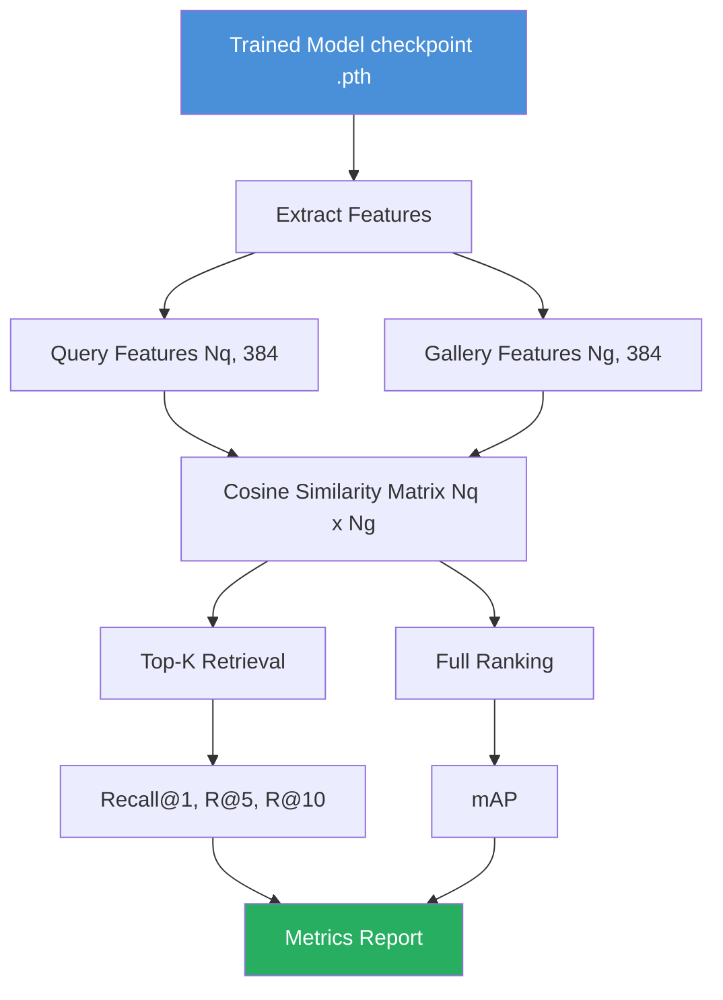
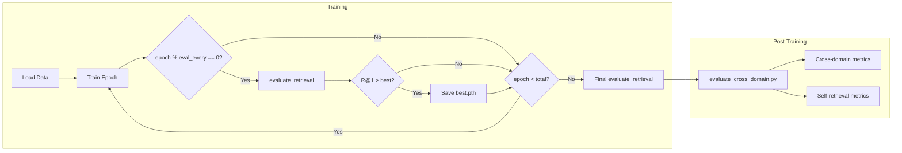
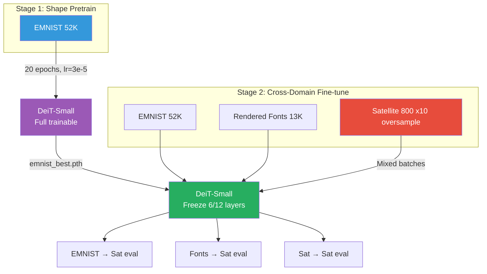

# Knowledge: Evaluation Pipeline — SatLetter VIT-IR

## Overview

**Mục đích**: Tài liệu chi tiết về hệ thống đánh giá kết quả (evaluation) của bài toán SatLetter — Image Retrieval sử dụng Vision Transformers (IRT) cho ảnh vệ tinh chứa hình dạng chữ cái.

**Ngôn ngữ / Framework**: Python 3.10+, PyTorch, timm

**Entry points chính**:
- `src/utils/evaluation.py` — Core evaluation metrics (Recall@K, mAP)
- `scripts/evaluate_cross_domain.py` — Cross-domain evaluation script
- `train.py` (lines 308–341) — Training loop integration
- `demo.py` — Retrieval demo with visualization

---

## Implementation Details

### 1. Evaluation Metrics

Dự án triển khai **2 metric chính** theo chuẩn image retrieval, dựa trên paper gốc (El-Nouby et al., ICML 2022):

#### 1.1 Recall@K (Metric chính)

**Định nghĩa**: Tỷ lệ query có ít nhất 1 kết quả đúng (cùng class) trong top-K kết quả trả về.

```
Recall@K = (1/Nq) × Σᵢ 𝟙[∃ correct match in top-K of query i]
```

**Giá trị K được đánh giá**: K ∈ {1, 5, 10}

**Implementation** (evaluation.py:45-88):

| Bước | Mô tả | Code |
|------|--------|------|
| 1 | Tính cosine similarity matrix `(Nq × Ng)` | `sim_matrix = torch.mm(query_features, gallery_features.t())` |
| 2 | Loại self-match (khi query = gallery) | `sim_matrix.fill_diagonal_(-inf)` |
| 3 | Lấy top-K indices | `sim_matrix.topk(max_k, dim=1)` |
| 4 | So sánh labels | `topk_labels == query_labels.unsqueeze(1)` |
| 5 | Recall@K = % query có ≥1 match đúng | `matches[:, :k].any(dim=1).float().mean()` |

> **IMPORTANT**: Features đã được **L2-normalized** trước khi tính similarity → `torch.mm` tương đương cosine similarity. Xem backbone.py:144-146.

#### 1.2 Mean Average Precision (mAP)

**Định nghĩa**: Trung bình của Average Precision trên tất cả queries.

```
AP(q) = (1/|R|) × Σₖ P(k) × rel(k)
mAP = (1/Nq) × Σ AP(q)
```

**Implementation** (evaluation.py:91-135):
- Sort gallery theo similarity giảm dần
- Tính precision tại mỗi vị trí có relevant result
- Average precision = tổng precision × relevance / số relevant

> **NOTE**: mAP trả về giá trị 0–100 (đã nhân 100). Recall@K cũng trả về 0–100.

### 2. Feature Extraction

**Function**: `extract_all_features()` (evaluation.py:17-42)

```python
@torch.no_grad()
def extract_all_features(model, dataloader, device) -> (features, labels):
    # model.eval() mode
    # Iterate all batches → collect (B, D) embeddings
    # Return concatenated (N, D) features + (N,) labels
```

**Chi tiết quan trọng**:
- Chạy trong `@torch.no_grad()` — không tính gradient
- Model ở eval mode — BatchNorm/Dropout behavior khác train
- Features đã L2-normalized từ backbone
- Output: `features (N, D)` = 384-D vectors, `labels (N,)` = class indices

### 3. Evaluation Pipeline Tổng hợp

**Function**: `evaluate_retrieval()` (evaluation.py:138-160)

```python
def evaluate_retrieval(model, test_loader, device, k_values=[1,5,10]):
    features, labels = extract_all_features(model, test_loader, device)
    
    # Query = Gallery (self-retrieval, exclude diagonal)
    recall = compute_recall_at_k(features, labels, features, labels, k_values, exclude_self=True)
    map_score = compute_map(features, labels, features, labels, exclude_self=True)
    
    return {"R@1": ..., "R@5": ..., "R@10": ..., "mAP": ...}
```

> **WARNING**: `evaluate_retrieval()` dùng **query = gallery** (self-retrieval). Cho cross-domain evaluation, sử dụng `evaluate_cross_domain.py` riêng.

---

## Evaluation Modes (v2 — Cross-Domain)

Dự án có **4 chế độ đánh giá** (cập nhật v2):

| Mode | Query Set | Gallery Set | exclude_self | Script |
|------|-----------|-------------|-------------|--------|
| **Cross-domain EMNIST** ⭐ | `emnist_letters/test` | `satellite_letters/test` | False | `evaluate_cross_domain.py` |
| **Cross-domain Fonts** | `rendered_fonts/test` | `satellite_letters/test` | False | `evaluate_cross_domain.py` |
| **Same-domain** | `satellite_letters/test` | `satellite_letters/test` | True | `evaluate_cross_domain.py` |
| **In-domain** | dataset/test | dataset/test | True | `train.py` (built-in) |

> **v2 thay đổi**: Query domain chuyển từ `sat_fonts` sang `emnist_letters` / `rendered_fonts` — phản ánh use case thực tế.

### Cross-Domain Evaluation Script

**File**: `scripts/evaluate_cross_domain.py` + `src/utils/evaluation.py:evaluate_cross_domain()`

```bash
# Primary: EMNIST → Satellite
python scripts/evaluate_cross_domain.py \
    --checkpoint checkpoints/cross_domain_best.pth \
    --query_dir dataset/emnist_letters \
    --gallery_dir dataset/satellite_letters

# Secondary: Fonts → Satellite
python scripts/evaluate_cross_domain.py \
    --checkpoint checkpoints/cross_domain_best.pth \
    --query_dir dataset/rendered_fonts \
    --gallery_dir dataset/satellite_letters
```

**Luồng thực thi**:
1. Load model từ checkpoint (khôi phục backbone, pooling, embed_dim từ saved args)
2. Load query dataset + gallery dataset
3. Extract features cho cả 2 sets
4. Tính metrics **cross-domain** (exclude_self=False vì query ≠ gallery)
5. Tính metrics **self-retrieval** (exclude_self=True vì query = gallery = NASA)

> **TIP**: Cross-domain dùng `exclude_self=False` vì query và gallery là 2 dataset khác nhau — không có self-match.

---

## Training Loop Integration

**File**: train.py:296-351

### Khi nào evaluation được chạy?

```python
for epoch in range(1, args.epochs + 1):
    train_metrics = train_one_epoch(...)
    
    # Evaluate every N epochs (default: 5) OR at final epoch
    if epoch % args.eval_every == 0 or epoch == args.epochs:
        eval_metrics = evaluate_retrieval(model, test_loader, device)
        
        # Save best model based on R@1
        if eval_metrics["R@1"] > best_recall:
            save_checkpoint(... f"{dataset}_best.pth")
    
    # Save periodic checkpoint every N epochs (default: 5)
    if epoch % args.save_every == 0:
        save_checkpoint(... f"{dataset}_epoch{epoch}.pth")

# Always run final evaluation
final_metrics = evaluate_retrieval(model, test_loader, device)
save_checkpoint(... f"{dataset}_final.pth")
```

### Checkpoint Format

```python
{
    "epoch": int,
    "model_state_dict": OrderedDict,
    "optimizer_state_dict": dict,
    "metrics": {"R@1": float, "R@5": float, "R@10": float, "mAP": float},
    "args": {
        "dataset": str,
        "backbone": str,
        "pooling": str,
        "embed_dim": int | None,
        "margin": float,
        "lambda_koleo": float,
        ...
    }
}
```

### Training History

Sau khi training xong, lưu JSON file:
```
checkpoints/{dataset}_history.json
```

Format: array of per-epoch records:
```json
[
  {"epoch": 1, "time": 12.3, "loss": 0.45, "loss_contrastive": 0.40, "loss_koleo": 0.07},
  {"epoch": 5, "time": 12.1, "loss": 0.30, "R@1": 65.2, "R@5": 80.1, "R@10": 88.3, "mAP": 45.6}
]
```

---

## So sánh với Paper gốc

### Paper Benchmarks (El-Nouby et al., 2022)

| Dataset | Model | R@1 | Ghi chú |
|---------|-------|-----|---------|
| **CUB-200** | DeiT-S (IRTR) | **74.7%** | 200 classes, 11,788 images |
| **CUB-200** | DeiT-S (IRTL, no KoLeo) | 74.2% | Contrastive loss only |
| **CUB-200** | DeiT-S (IRTO, off-the-shelf) | 58.5% | Không fine-tune |
| **SOP** | DeiT-S (IRTR) | **84.0%** | 11,316 test classes |
| **In-Shop** | DeiT-S (IRTR) | **91.5%** | 3,985 test classes |

### SatLetter Target Metrics v2

| Evaluation Mode | Target R@1 | Stretch | Ghi chú |
|----------------|------------|---------|--------|
| Cross-domain EMNIST→Satellite | >40% | >55% | Primary use case |
| Cross-domain Fonts→Satellite | >45% | >60% | Robustness check |
| Same-domain Sat→Sat | >60% | >75% | Baseline quality |
| In-domain (training set) | >70% | >85% | Sanity check |

> **IMPORTANT**: Dự án SatLetter có **26 classes** (A-Z) so với CUB-200 có **200 classes** hoặc SOP **11,316 classes**. Recall@1 trên SatLetter nên cao hơn đáng kể vì ít classes hơn → xác suất random match cao hơn (baseline: ~3.8% vs 0.5%).

---

## Ablation Studies

| # | Experiment | Biến thay đổi | Flag | Status |
|---|-----------|---------------|------|--------|
| 1 | Pretrain source | ImageNet vs EMNIST vs EMNIST+Fonts | `--pretrained_from` | ✅ Ready |
| 2 | Loss function | Contrastive only vs +KoLeo | `--no_koleo` | ✅ Ready |
| 3 | Pooling method | CLS vs Avg vs GeM | `--pooling` | ✅ Ready |
| 4 | Descriptor dim | 384 (native) vs 128 | `--embed_dim 128` | ✅ Ready |
| 5 | Backbone freeze | 0 / 3 / 6 / 9 layers | `--freeze_layers 6` | ✅ **Implemented** |
| 6 | Training strategy | Single-stage vs Two-stage | `--dataset cross_domain` | ✅ **Implemented** |
| 7 | Satellite oversample | 5x / 10x / 20x | `--satellite_oversample` | ✅ **Implemented** |

```bash
# v2 Baseline: Two-stage cross-domain
bash scripts/train_stage1.sh   # Stage 1: EMNIST pretrain
bash scripts/train_stage2.sh   # Stage 2: cross-domain fine-tune

# Ablation: No KoLeo
python train.py --dataset cross_domain --pretrained_from checkpoints/emnist_best.pth --no_koleo --freeze_layers 6

# Ablation: Different freeze depths
python train.py --dataset cross_domain --pretrained_from checkpoints/emnist_best.pth --freeze_layers 3
python train.py --dataset cross_domain --pretrained_from checkpoints/emnist_best.pth --freeze_layers 9

# Ablation: Oversample factor
python train.py --dataset cross_domain --pretrained_from checkpoints/emnist_best.pth --satellite_oversample 5
python train.py --dataset cross_domain --pretrained_from checkpoints/emnist_best.pth --satellite_oversample 20
```

---

## Dependencies

### Internal Dependencies (depth 1–3)

```
evaluate_retrieval()                    # evaluation.py:138
├── extract_all_features()              # evaluation.py:17
│   ├── model.eval()                    # backbone.py IRTModel
│   ├── model(images)                   # backbone.py:113 forward()
│   │   ├── forward_features()          # backbone.py:94 (timm DeiT)
│   │   ├── pooling (cls/avg/max/gem)   # backbone.py:125-138
│   │   ├── projector (optional)        # backbone.py:141-142
│   │   └── F.normalize(p=2)            # backbone.py:146
│   └── DataLoader iteration            # datasets.py:90
├── compute_recall_at_k()               # evaluation.py:45
│   └── torch.mm (cosine similarity)
└── compute_map()                       # evaluation.py:91
    └── argsort + cumsum AP
```

### External Dependencies

| Package | Version | Dùng cho |
|---------|---------|----------|
| `torch` | ≥2.0 | Tensor ops, model, training |
| `timm` | ≥0.9 | DeiT backbone (pretrained weights) |
| `torchvision` | ≥0.15 | ImageFolder dataset, transforms |
| `tqdm` | any | Progress bar trong feature extraction |
| `numpy` | any | Array ops (minimal usage) |
| `matplotlib` | optional | Visualization trong demo.py |
| `PIL/Pillow` | any | Image loading, augmentation |

---

## Visual Diagrams

### Evaluation Flow



### Training + Evaluation Lifecycle



### v2 Training + Evaluation Architecture



---

## Additional Insights

### Điểm mạnh v2

1. **Cross-domain training**: Mixed batches EMNIST+Fonts+Satellite với oversampling
2. **Backbone freezing**: `--freeze_layers 6` giữ shape features, train adaptation layers
3. **NaN protection**: KoLeo loss clamp + gradient clipping + NaN guard
4. **4 evaluation modes**: Đánh giá toàn diện cross-domain và same-domain
5. **Training history**: JSON log cho data analytics

### Điểm cần cải thiện

1. **Thiếu per-class metrics**: Cần breakdown Recall@K theo A-Z
2. **Thiếu visualization**: t-SNE/UMAP chưa implement
3. **Thiếu Precision@K**: Bổ sung cho Recall@K

---

## Data Analytics & Visualization (Gợi ý)

### 1. Training Loss Curves

```python
import pandas as pd
import matplotlib.pyplot as plt

# Load training history
history = pd.read_json('checkpoints/cross_domain_history.json')

fig, axes = plt.subplots(1, 3, figsize=(18, 5))

# Plot 1: Total Loss
axes[0].plot(history['epoch'], history['loss'], 'b-')
axes[0].set_title('Total Loss per Epoch')
axes[0].set_xlabel('Epoch'); axes[0].set_ylabel('Loss')

# Plot 2: Loss Components
axes[1].plot(history['epoch'], history['loss_contrastive'], 'r-', label='Contrastive')
axes[1].plot(history['epoch'], history['loss_koleo'], 'g-', label='KoLeo')
axes[1].legend(); axes[1].set_title('Loss Components')

# Plot 3: Recall@K Curves
eval_rows = history.dropna(subset=['R@1'])
for k in ['R@1', 'R@5', 'R@10']:
    axes[2].plot(eval_rows['epoch'], eval_rows[k], '-o', label=k)
axes[2].legend(); axes[2].set_title('Recall@K During Training')
plt.tight_layout(); plt.savefig('training_curves.png', dpi=150)
```

### 2. Dataset Distribution Analysis

```python
import os, glob
import pandas as pd
import matplotlib.pyplot as plt

def count_dataset(root):
    data = []
    for split in ['train', 'test']:
        for cls in sorted(os.listdir(os.path.join(root, split))):
            n = len(glob.glob(os.path.join(root, split, cls, '*.png')))
            data.append({'split': split, 'class': cls, 'count': n})
    return pd.DataFrame(data)

df_emnist = count_dataset('dataset/emnist_letters')
df_fonts = count_dataset('dataset/rendered_fonts')
df_sat = count_dataset('dataset/satellite_letters')

# Bar chart: samples per class per dataset
fig, axes = plt.subplots(1, 3, figsize=(18, 5))
for ax, df, title in zip(axes, [df_emnist, df_fonts, df_sat],
                          ['EMNIST', 'Rendered Fonts', 'Satellite']):
    train = df[df['split']=='train'].set_index('class')['count']
    test = df[df['split']=='test'].set_index('class')['count']
    train.plot.bar(ax=ax, alpha=0.7, label='train')
    test.plot.bar(ax=ax, alpha=0.5, label='test', color='orange')
    ax.set_title(f'{title} Distribution'); ax.legend()
plt.tight_layout(); plt.savefig('dataset_distribution.png', dpi=150)
```

### 3. Cross-Domain Similarity Heatmap

```python
import torch
import seaborn as sns
import numpy as np

# After extracting features:
# q_feats (Nq, 384), q_labels (Nq,), g_feats (Ng, 384), g_labels (Ng,)
sim_matrix = torch.mm(q_feats, g_feats.t()).numpy()

# Average similarity per class pair
classes = list('ABCDEFGHIJKLMNOPQRSTUVWXYZ')
class_sim = np.zeros((26, 26))
for qi in range(26):
    for gi in range(26):
        mask_q = (q_labels == qi)
        mask_g = (g_labels == gi)
        if mask_q.sum() > 0 and mask_g.sum() > 0:
            class_sim[qi, gi] = sim_matrix[mask_q][:, mask_g].mean()

plt.figure(figsize=(12, 10))
sns.heatmap(class_sim, xticklabels=classes, yticklabels=classes,
            cmap='RdYlGn', annot=True, fmt='.2f', vmin=0, vmax=1)
plt.title('Cross-Domain Similarity: EMNIST → Satellite')
plt.xlabel('Satellite Gallery Class'); plt.ylabel('EMNIST Query Class')
plt.savefig('cross_domain_heatmap.png', dpi=150)
```

### 4. t-SNE Embedding Visualization

```python
from sklearn.manifold import TSNE
import matplotlib.pyplot as plt
import numpy as np

# Combine features from both domains
all_feats = torch.cat([q_feats, g_feats]).numpy()
all_labels = torch.cat([q_labels, g_labels]).numpy()
domains = ['EMNIST'] * len(q_feats) + ['Satellite'] * len(g_feats)

tsne = TSNE(n_components=2, perplexity=30, random_state=42)
embeddings_2d = tsne.fit_transform(all_feats)

fig, axes = plt.subplots(1, 2, figsize=(16, 7))

# Color by class
scatter = axes[0].scatter(embeddings_2d[:, 0], embeddings_2d[:, 1],
                          c=all_labels, cmap='tab20', s=5, alpha=0.6)
axes[0].set_title('t-SNE: Color by Letter Class')

# Color by domain
colors = ['blue' if d == 'EMNIST' else 'red' for d in domains]
axes[1].scatter(embeddings_2d[:, 0], embeddings_2d[:, 1],
                c=colors, s=5, alpha=0.4)
axes[1].set_title('t-SNE: Blue=EMNIST, Red=Satellite')
plt.savefig('tsne_embeddings.png', dpi=150)
```

### 5. Per-Class Recall@K DataFrame

```python
import pandas as pd

def per_class_recall(q_feats, q_labels, g_feats, g_labels, k=1):
    sim = torch.mm(q_feats, g_feats.t())
    topk_idx = sim.topk(k, dim=1).indices
    topk_labels = g_labels[topk_idx]
    matches = (topk_labels == q_labels.unsqueeze(1)).any(dim=1)
    
    results = []
    classes = list('ABCDEFGHIJKLMNOPQRSTUVWXYZ')
    for ci in range(26):
        mask = (q_labels == ci)
        if mask.sum() > 0:
            r = matches[mask].float().mean().item() * 100
            results.append({'class': classes[ci], f'R@{k}': r, 'n_queries': mask.sum().item()})
    return pd.DataFrame(results)

df = per_class_recall(q_feats, q_labels, g_feats, g_labels, k=1)
print(df.sort_values('R@1', ascending=True))  # Weakest classes first
df.plot.bar(x='class', y='R@1', figsize=(14, 5), title='Per-Class Recall@1')
```

### 6. Ablation Results DataFrame

```python
# Sau khi chạy ablation studies, collect kết quả:
ablation_results = pd.DataFrame([
    {'experiment': 'Baseline (v2)', 'R@1': None, 'R@5': None, 'mAP': None},
    {'experiment': 'No KoLeo', 'R@1': None, 'R@5': None, 'mAP': None},
    {'experiment': 'Freeze 3 layers', 'R@1': None, 'R@5': None, 'mAP': None},
    {'experiment': 'Freeze 9 layers', 'R@1': None, 'R@5': None, 'mAP': None},
    {'experiment': 'Oversample 5x', 'R@1': None, 'R@5': None, 'mAP': None},
    {'experiment': 'Oversample 20x', 'R@1': None, 'R@5': None, 'mAP': None},
    {'experiment': 'GeM pooling', 'R@1': None, 'R@5': None, 'mAP': None},
])
# Fill in after running experiments
```

---

## Metadata

| Field | Value |
|-------|-------|
| **Analysis date** | 2026-05-09 (updated) |
| **Version** | v2 — Cross-Domain Pipeline |
| **Depth** | 3 levels (evaluation → model → backbone internals) |
| **Files analyzed** | `src/utils/evaluation.py`, `scripts/evaluate_cross_domain.py`, `train.py`, `demo.py`, `src/models/backbone.py`, `src/losses/irt_losses.py`, `src/data/datasets.py` |
| **Based on paper** | "Training Vision Transformers for Image Retrieval" (El-Nouby et al., ICML 2022) |
| **Project** | SatLetter — Đồ án môn học PTIT |

---

## Next Steps

1. **Implement per-class Recall@K** — dùng code ở section Data Analytics
2. **Implement t-SNE visualization** — dùng code ở section Data Analytics
3. **Chạy full ablation matrix** — 7 experiments × cross-domain evaluation
4. **Generate heatmap** — cross-domain similarity matrix A-Z × A-Z
5. **Document actual results** — cập nhật ablation DataFrame sau training
6. **Thêm Precision@K metric** — bổ sung cho Recall@K
