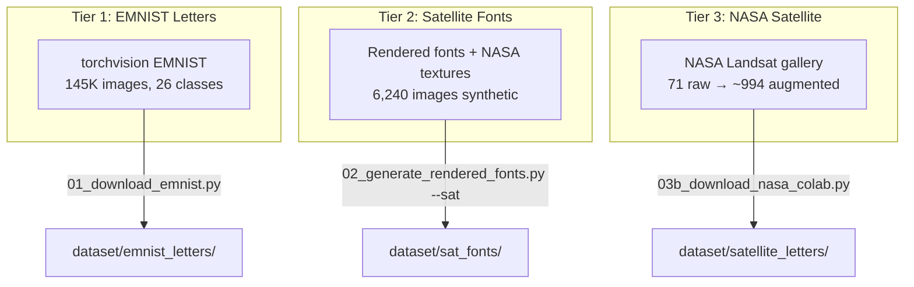
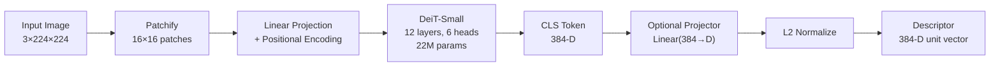
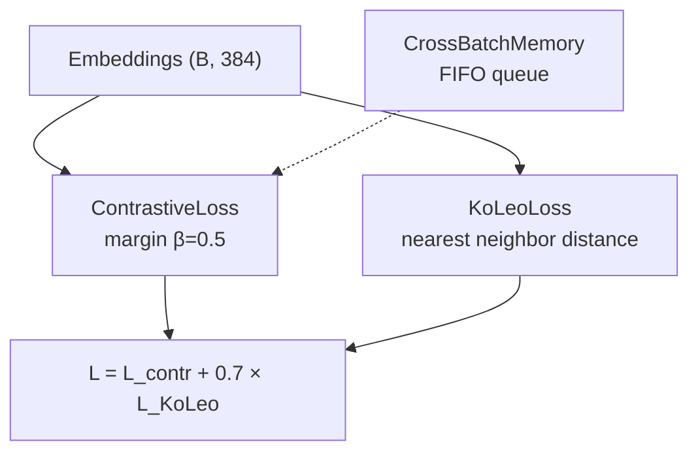
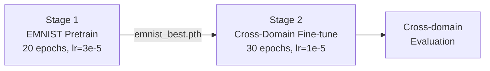
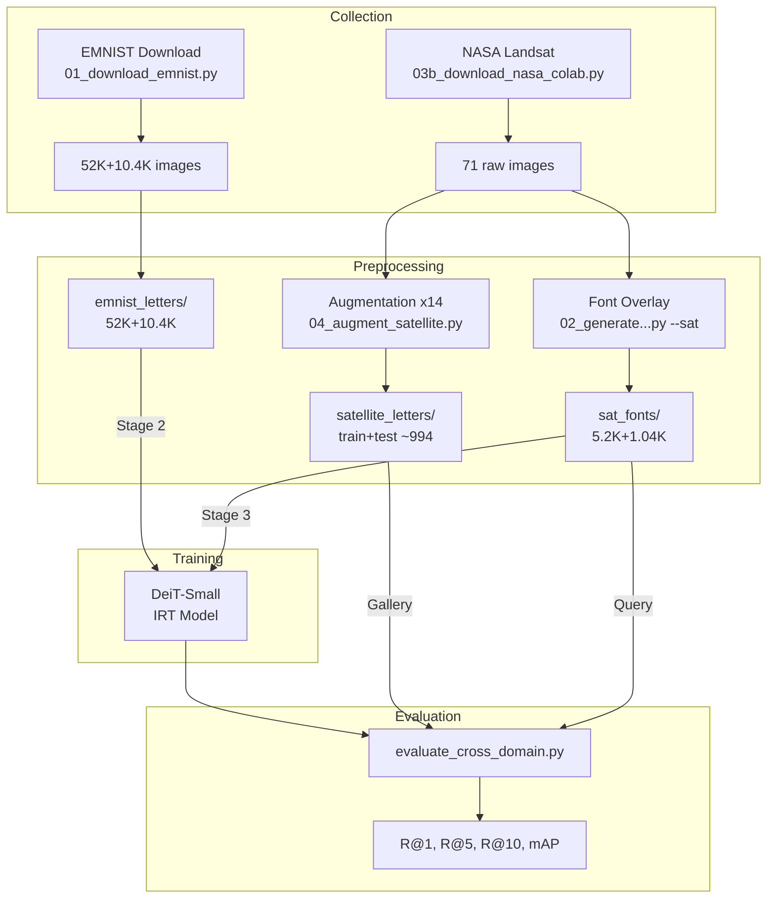

# Knowledge: SatLetter — Vòng đời phát triển hệ thống ML

## 1. Overview

**Dự án**: SatLetter — Image Retrieval cho ảnh vệ tinh chứa hình dạng chữ cái
**Paper gốc**: "Training Vision Transformers for Image Retrieval" (El-Nouby et al., ICML 2022)
**Ngôn ngữ**: Python 3.10+, PyTorch, timm
**Môi trường**: Google Colab T4 GPU (15GB VRAM)

---

## 2. Đọc hiểu bài báo

### 2.1 Vấn đề nghiên cứu
Paper đề xuất **IRT (Image Retrieval Transformers)** — dùng Vision Transformer thay CNN cho image retrieval. Kiến trúc Siamese + metric learning.

### 2.2 Ba biến thể IRT

| Biến thể | Mô tả | Kỹ thuật |
|----------|--------|----------|
| **IRTO** | Off-the-shelf | Trích features từ ViT pretrained ImageNet, không fine-tune |
| **IRTL** | Learned | Fine-tune với contrastive loss |
| **IRTR** | Regularized | Contrastive + KoLeo entropy regularization |

### 2.3 Công thức toán học chính

**Contrastive Loss** (Eq.1):
```
L_contr = (1/N) Σ_i [ Σ_{j:yi=yj} [1 - zi·zj]+ + Σ_{j:yi≠yj} [zi·zj - β]+ ]
```

**KoLeo Loss** (Eq.5):
```
L_KoLeo = -(1/N) Σ_i log(ρ_i),  ρ_i = min_{j≠i} ||zi - zj||
```

**Combined IRT Loss**:
```
L = L_contr + λ × L_KoLeo
```

### 2.4 Hyperparameters (theo paper)
- Optimizer: AdamW, lr=3e-5, weight_decay=5e-4
- Batch size: 64, margin β=0.5, λ=0.7
- Backbone: DeiT-Small (22M params, 384-D)
- Image: 224×224, augment: resize 256→random crop 224 + horizontal flip

### 2.5 Kết quả paper (benchmarks)

| Dataset | IRTO R@1 | IRTL R@1 | IRTR R@1 |
|---------|----------|----------|----------|
| SOP | 52.8% | 83.0% | **84.0%** |
| CUB-200 | 58.5% | 74.2% | **74.7%** |
| In-Shop | 31.3% | 90.3% | **91.5%** |

### 2.6 Insights quan trọng từ paper
1. **CLS token > pooling**: CLS token cho kết quả tốt nhất hoặc ngang GeM/Avg/Max
2. **KoLeo chống collapse**: Contrastive loss gây dimensional collapse, KoLeo giải quyết bằng cách spread vectors trên hypersphere
3. **ViT ít collapse hơn CNN**: Multi-headed attention tự nhiên chống collapse tốt hơn ResNet
4. **Cross-Batch Memory**: FIFO queue lưu embeddings từ batches trước → nhiều negatives hơn

---

## 3. Thu thập dữ liệu (Data Collection)

### 3.1 Chiến lược 3-Tier



### 3.2 Script pipeline

| Step | Script | Input | Output | Tự động? |
|------|--------|-------|--------|----------|
| 1 | `01_download_emnist.py` | torchvision API | 52K train + 10.4K test | ✅ |
| 2 | `02_generate_rendered_fonts.py` | System fonts | 13K train + 2.6K test | ✅ |
| 3 | `03b_download_nasa_colab.py` | NASA URL pattern | 71 raw images | ✅ |
| 4 | `04_augment_satellite.py` | NASA raw | ~994 augmented | ✅ |
| 5 | `02_generate_rendered_fonts.py --sat` | Fonts + NASA textures | 5.2K train + 1.04K test | ✅ |
| 6 | `05_verify_dataset.py` | All datasets | Stats report | ✅ |

### 3.3 NASA Landsat — Chi tiết thu thập
- **URL**: `https://science.nasa.gov/specials/your-name-in-landsat/images/{letter}_{index}.jpg`
- **Tổng**: 71 ảnh (a:5 b:2 c:3 ... z:2), phân bố không đều
- **Retry logic**: 3 attempts, rate limit handling (429), timeout 30s
- **Collection guide**: Tự động tạo hướng dẫn thu thập bổ sung từ Google Earth

---

## 4. Tiền xử lý (Preprocessing)

### 4.1 EMNIST Letters
```python
# 01_download_emnist.py
img.transpose(Image.TRANSPOSE)  # EMNIST bị rotated/flipped
img.convert("RGB")               # Grayscale → RGB
img.resize((224, 224))           # 28×28 → 224×224
```
- Labels: 1-26 → A-Z
- Max per class: 2000 train, 400 test

### 4.2 Satellite Fonts (Approach B)
```python
# 02_generate_rendered_fonts.py --sat
# Background: 85% NASA crop, 15% synthetic/plain
# Letter: Alpha compositing (α=100-220) cho natural blending
# Color: Contrast-aware (offset ±40-120 từ bg mean)
# Augment: rotation ±35°, blur, brightness, contrast jitter
```

### 4.3 NASA Augmentation
```python
# 04_augment_satellite.py — 14 augmentations per image:
# 1 original + 1 h-flip + 1 v-flip + 3 rotations (90/180/270)
# + 2 random rotations + 2 random crops + 2 color jitter
# + 1 blur + 1 sharpen = 14 variants
# Split: 80% train, 20% test
```

### 4.4 Training Transforms
```python
# datasets.py
train: Resize(256) → RandomCrop(224) → RandomHFlip → Normalize(ImageNet)
eval:  Resize(224) → Normalize(ImageNet)
# ImageNet stats: mean=[0.485, 0.456, 0.406], std=[0.229, 0.224, 0.225]
```

---

## 5. Kiến trúc tổng quan (Architecture)

### 5.1 Model Architecture



### 5.2 IRTModel (backbone.py)

| Component | Implementation | Params |
|-----------|---------------|--------|
| Backbone | `timm.create_model('deit_small_patch16_224')` | 22M |
| Pooling | CLS token (default) / Avg / Max / GeM | 0 |
| Projector | `nn.Linear(384, embed_dim)` (optional) | 384×D |
| Normalize | `F.normalize(p=2, dim=-1)` | 0 |

### 5.3 Loss Functions (irt_losses.py)



### 5.4 Cross-Batch Memory (XBM)
- FIFO queue: `register_buffer` cho embeddings + labels
- Wrap-around khi đầy, `is_full` flag
- Cung cấp thêm negative pairs cho contrastive loss

---

## 6. Training Pipeline (v2 — Two-Stage Cross-Domain)

### 6.1 Stages



### 6.2 Training Loop (train.py)

```python
for epoch in range(1, epochs + 1):
    # Forward: images → model → embeddings (B, 384)
    # NaN guard: skip batch if loss is NaN
    # Loss: IRTLoss(embeddings, labels, memory)
    # Backward: zero_grad → backward → clip_grad_norm_(max_norm=1.0) → step
    # Memory: XBM.enqueue(embeddings.detach(), labels.detach())
    
    if epoch % eval_every == 0:
        metrics = evaluate_retrieval(model, test_loader)
        if metrics["R@1"] > best_recall:
            save_checkpoint("best.pth")
```

### 6.3 Hyperparameters

| Param | Stage 1 (EMNIST) | Stage 2 (Cross-Domain) |
|-------|------------------|------------------------|
| Dataset | emnist | cross_domain (EMNIST+Fonts+Sat) |
| Epochs | 20 | 30 |
| Batch size | 64 | 64 |
| Learning rate | 3e-5 | 1e-5 |
| Weight decay | 5e-4 | 5e-4 |
| λ (KoLeo) | 0.7 | 0.7 |
| β (margin) | 0.5 | 0.5 |
| Freeze layers | 0 (full trainable) | 6 (freeze 6/12 blocks) |
| XBM size | 0 (disabled) | 2048 |
| Sat oversample | — | 10x |
| Pretrained from | ImageNet | emnist_best.pth |

---

## 7. Đánh giá (Evaluation)

### 7.1 Metrics
- **Recall@K** (K=1,5,10): % queries có ≥1 match đúng trong top-K
- **mAP**: Mean Average Precision trên full ranking

### 7.2 Bốn chế độ đánh giá (v2)

| Mode | Query | Gallery | exclude_self | Script |
|------|-------|---------|-------------|--------|
| Cross-domain EMNIST ⭐ | emnist_letters/test | satellite_letters/test | False | evaluate_cross_domain.py |
| Cross-domain Fonts | rendered_fonts/test | satellite_letters/test | False | evaluate_cross_domain.py |
| Same-domain | satellite_letters/test | satellite_letters/test | True | evaluate_cross_domain.py |
| In-domain | dataset/test | dataset/test | True | train.py |

### 7.3 Evaluation Flow
```
model → extract_all_features(test_loader) → (N, 384) features
→ cosine similarity matrix → topk → Recall@K
→ full sort → AP per query → mAP
```

---

## 8. So sánh & Ablation Studies

### 8.1 Paper vs SatLetter Targets

| Metric | Paper CUB-200 | SatLetter In-domain | SatLetter Cross-domain |
|--------|--------------|---------------------|----------------------|
| R@1 | 74.7% | >70% (target) | >40% (target) |
| Classes | 200 | 26 | 26 |

### 8.2 Ablation Matrix

| # | Variable | Values | Flag | Status |
|---|----------|--------|------|--------|
| 1 | Pretrain | ImageNet / EMNIST / EMNIST+Fonts | `--pretrained_from` | ✅ |
| 2 | Loss | Contrastive / +KoLeo | `--no_koleo` | ✅ |
| 3 | Pooling | CLS / Avg / GeM | `--pooling` | ✅ |
| 4 | Dim | 384 / 128 | `--embed_dim` | ✅ |
| 5 | Freeze | 0 / 3 / 6 / 9 layers | `--freeze_layers` | ✅ **Done** |
| 6 | Strategy | Single vs Two-stage | `--dataset cross_domain` | ✅ **Done** |
| 7 | Oversample | 5x / 10x / 20x | `--satellite_oversample` | ✅ **Done** |

---

## 9. Data Pipeline Flow



---

## 10. Phương pháp đề xuất cải thiện

### 10.1 Cải thiện dữ liệu

| # | Đề xuất | Lý do | Độ ưu tiên |
|---|---------|-------|------------|
| 1 | **Thu thập thêm ảnh Google Earth** | 71 ảnh NASA quá ít, class imbalance (1-5/class) | 🔴 Cao |
| 2 | **Hard negative mining trong dataset** | Chữ cái giống nhau (O/Q, C/G) cần được phân biệt rõ | 🟡 TB |
| 3 | **Multi-scale augmentation** | Ảnh satellite có nhiều scale khác nhau | 🟡 TB |
| 4 | **CutMix/MixUp cho satellite fonts** | Tăng diversity, giảm overfitting | 🟢 Thấp |

### 10.2 Cải thiện model

| # | Đề xuất | Chi tiết | Độ ưu tiên |
|---|---------|----------|------------|
| 1 | **Backbone freeze + projection head** | Freeze DeiT, chỉ train Linear head → tránh overfit trên dataset nhỏ | 🔴 Cao |
| 2 | **Multi-scale feature fusion** | Concat CLS + GeM từ nhiều layers | 🟡 TB |
| 3 | **Label smoothing** | Soft labels cho contrastive → robust hơn | 🟡 TB |
| 4 | **DeiT-Small distilled (DeiT-S†)** | Paper cho thấy distilled variant tốt hơn | 🟢 Thấp |

### 10.3 Cải thiện training

| # | Đề xuất | Chi tiết | Độ ưu tiên |
|---|---------|----------|------------|
| 1 | **Cosine annealing LR scheduler** | Paper dùng fixed LR, scheduler có thể tốt hơn | 🔴 Cao |
| 2 | **Gradient accumulation** | Effective batch size lớn hơn → nhiều negatives hơn | 🟡 TB |
| 3 | **Progressive training** | EMNIST → rendered_fonts → sat_fonts (3 stages) | 🟡 TB |
| 4 | **Early stopping** | Monitor cross-domain R@1, stop khi plateau | 🟢 Thấp |

### 10.4 Cải thiện evaluation

| # | Đề xuất | Chi tiết | Độ ưu tiên |
|---|---------|----------|------------|
| 1 | **Per-class Recall@K** | Breakdown theo A-Z → tìm classes yếu | 🔴 Cao |
| 2 | **t-SNE visualization** | Code đã có trong colab_setup.py, cần integrate | 🟡 TB |
| 3 | **Confusion matrix retrieval** | Ma trận nhầm lẫn giữa các chữ cái | 🟢 Thấp |

---

## 11. Dependencies

### Internal
```
train.py
├── src/models/backbone.py      (IRTModel, build_model, GeM, freeze_layers)
├── src/losses/irt_losses.py    (ContrastiveLoss, KoLeoLoss+clamp, IRTLoss, XBM)
├── src/data/datasets.py        (CrossDomainDataset, get_cross_domain_loaders, ...)
└── src/utils/evaluation.py     (evaluate_cross_domain, extract_all_features, ...)
```

### External
```
torch>=2.0, torchvision>=0.15, timm>=0.9
Pillow>=9.0, numpy>=1.21, requests>=2.28
tqdm>=4.64, matplotlib>=3.5, seaborn (heatmap)
Optional: scikit-learn (t-SNE), umap-learn
```

---

## 12. Cấu trúc dự án

```
vit-ir/
├── paper/                          # Bài báo gốc (PDF + text)
├── docs/plans/                     # Design documents
├── scripts/                        # Dataset pipeline (6 scripts)
│   ├── 01_download_emnist.py       # Tier 1
│   ├── 02_generate_rendered_fonts.py # Tier 2 (+ --sat mode)
│   ├── 03b_download_nasa_colab.py  # Tier 3
│   ├── 04_augment_satellite.py     # Augmentation
│   ├── 05_verify_dataset.py        # Verification
│   ├── evaluate_cross_domain.py    # Cross-domain eval
│   ├── colab_setup.py              # 12-cell Colab notebook
│   └── run_pipeline.py             # Master runner
├── src/
│   ├── models/backbone.py          # DeiT-Small IRT model
│   ├── losses/irt_losses.py        # Contrastive + KoLeo + XBM
│   ├── data/datasets.py            # DataLoaders + transforms
│   └── utils/evaluation.py         # Recall@K, mAP
├── train.py                        # Training loop
├── demo.py                         # Retrieval demo
└── requirements.txt
```

---

## Metadata

| Field | Value |
|-------|-------|
| Analysis date | 2026-05-08 |
| Depth | 3 levels |
| Files analyzed | 18 files (all source + scripts + paper + docs) |
| Paper | El-Nouby et al., "Training Vision Transformers for Image Retrieval", ICML 2022 |
| Project | SatLetter — Đồ án PTIT |

---

## Next Steps

1. ✅ ~~Implement `--freeze_layers`~~ — Done (v2)
2. ✅ ~~CrossDomainDataset + oversampling~~ — Done (v2)
3. **Chạy data analytics** — dùng code từ knowledge-evaluation-pipeline.md
4. **Per-class Recall@K** — breakdown theo A-Z, tìm classes yếu
5. **t-SNE visualization** — cross-domain embedding space
6. **Similarity heatmap** — 26×26 class confusion matrix
7. **Thu thập thêm ảnh** từ Google Earth cho classes thiếu
8. **Thêm LR scheduler** (cosine annealing)
9. **Cập nhật tài liệu** với kết quả thực tế sau training
